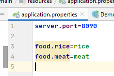
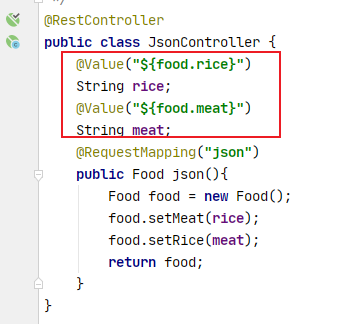
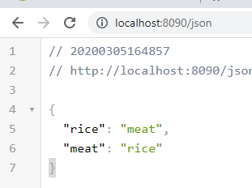
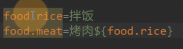

1.  banner的使用:
    放在资源文件的路径下.

2. 更改启动端口
    + 内部配置使用 在资源路径下的application.properties/yml 文件下
        配置server.port=8089
    + 外部配置使用
        java -jar xxxx.jar --server.port=8089

更多配置可以在文档的附录查看        

3. 使用注解@RestController 

+ 表示返回的结果使用rest规范 都是JSON格式
  使用@RestController可以直接返回bean对象 底层会进行解析.
+ 使用@RestController就不用使用@Controller和@ResponseBody

4. 使用@Value可以将容器里的值取出 `@Value("${food.rice}")`

配置文件里面可以互相引用

